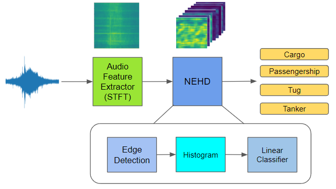

# Neural Edge Histogram Descriptors (NEHD) for Underwater Acoustic Target Recognition
<p align="center">
  
</p>


**Neural Edge Histogram Descriptors (NEHD) for Underwater Acoustic Target Recognition**

Atharva Girish Agashe, Davelle Carreiro, Alexandra Van Dine, Joshua Peeples

Note: If this code is used, cite it:  Atharva Girish Agashe, Davelle Carreiro, Alexandra Van Dine, Joshua Peeples. (2025, March 24) Peeples-Lab/NEHD_UATR: Initial Release (Version v1.0).

<!-- [`arXiv`](https://arxiv.org/abs/2307.13788)

[`BibTeX`](#CitingHist) -->


In this repository, we provide the paper and code for "Neural Edge Histogram Descriptors (NEHD) for Underwater Acoustic Target Recognition."

## Installation Prerequisites


The [`requirements.txt`](requirements.txt) file includes all the necessary packages, and the packages will be installed using:

   ```pip install -r requirements.txt```


## Demo

To get started, please follow the instructions in the [Datasets](Datasets) folder to download the dataset.
Next, run [`demo.py`](demo.py) in Python IDE (e.g., Spyder) or command line to train, validate, and test models. 
To evaluate performance,
run [`View_Results.py`](view_results.py) (if results are saved out).


## Main Functions

The target classification code uses the following functions. 

1. Intialize model  

   ```model = intialize_model(**Parameters)```

2. Prepare dataset(s) for model
   
   ```data_module = DeepShipDataModule(**Parameters)```

3. Train model 

   ```trainer.fit(**Parameters)```

4. Test model

   ```trainer.test(**Parameters)```


## Parameters

The parameters can be set in the following script:
   
[`Demo_Parameters.py`](Demo_Parameters.py)

## Inventory

```
https://github.com/Peeples-Lab/HLTDNN 

└── root directory
    ├── demo.py                           // Run this. Main demo file.
    ├── Demo_Parameters.py                // Parameter file for the demo.
    ├── view_Results.py                   // Run this after the demo to view saved results. 
    └── Datasets                
        ├── Get_Preprocessed_Data.py      // Resample the audio data and generate segments for the dataset.
        └── DeepShipDataModules.py.py     // Create a custom dataset for DeepShip.
    └── Models
        ├── EHD.py                        // Compute the Edge Histogram Descriptors
        ├── Feature_Extractor.py          // Extract and transform different features from the audio files.
        ├── Lightning_Models.py           // Various NN models created using Lightning
        ├── Lightning_Wrapper.py          // Wrapper class for creating Lightning Model
        ├── NEHD.py                       // Compute the Neural Edge Histogram Descriptors
        ├── PANN_models.py                // Define pretrained audio neural networks.
        └── RBFHistogramPooling.py        // Create histogram layer.
    └── Utils
        ├── aggregate_results.py          // Aggregrate all expeiment reuslts`
        ├── Compute_sizes.py              // Compute the feature size
        ├── Confusion_mats.py             // Create and plot confusion matrix.
        ├── Generate_Learning_Curves.py   // Generate learning curves for training and validation.
        ├── Get_min_max.py                // Get min max values for normalization
        ├── Network_functions.py          // Contains functions to initialize feature extractor and various models
        ├── pytorchtools.py               // Implement early stopping to terminate training based on validation metrics.
        └── Save_Results.py               // Save results from the demo script.


```

## License

This source code is licensed under the license found in the [`LICENSE`](LICENSE) file in the root directory of this source tree.

This product is Copyright (c) 2025 TBD. All rights reserved.

## <a name="CitingHist"></a>Citing NEHD_UATR

If you use the NEHD_UATR code, please cite:

**Plain Text:**

Atharva Agashe, Davelle Carreiro, Alexandra Van Dine, Joshua Peeples. "Neural Edge Histogram Descriptors for Underwater Acoustic Target Recognition." (2025).

Available on [arXiv](https://arxiv.org/abs/2503.13763).

**BibTex:**
```
@misc{agashe2025neuraledgehistogramdescriptors,
      title={Neural Edge Histogram Descriptors for Underwater Acoustic Target Recognition}, 
      author={Atharva Agashe and Davelle Carreiro and Alexandra Van Dine and Joshua Peeples},
      year={2025},
      eprint={2503.13763},
      archivePrefix={arXiv},
      primaryClass={cs.LG},
      url={https://arxiv.org/abs/2503.13763}, 
}
```

